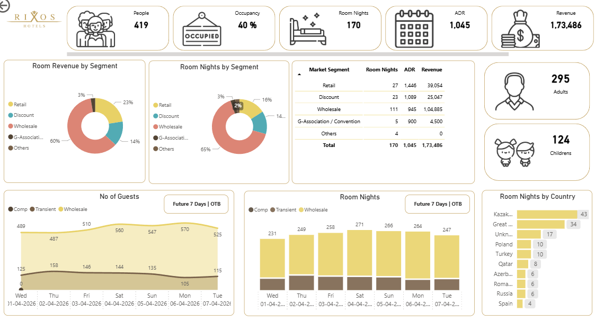

# Hotel Analytics Dashboard (Rixos)

## Overview
This project showcases a Hotel Revenue Analytics dashboard built using Power BI. It provides insights into key hospitality KPIs such as occupancy, ADR (Average Daily Rate), revenue, and room night performance.

The dashboard is designed to support data-driven decision-making in hotel operations by analyzing market segments, guest trends, and country-wise performance.

---

## Dashboard Preview

---

## Key KPIs
- Occupancy Rate: 40%
- ADR (Average Daily Rate): 1,045
- Revenue: 173,486
- Room Nights: 170
- Total Guests: 419

---

## Key Features
- Revenue analysis by market segment (Retail, Discount, Wholesale, Group)
- Room nights distribution across segments
- Guest breakdown (Adults vs Children)
- Country-wise room night performance
- Trend analysis for guests and room nights
- Future 7-day booking outlook

---

## Business Insights
- Wholesale segment contributes the highest share of revenue and room nights  
- Weekend occupancy trends are higher compared to weekdays  
- Key countries driving room nights can be targeted for marketing campaigns  
- Discount segment shows potential for pricing optimization  

---

## Tools & Technologies
- Power BI  
- DAX (Data Analysis Expressions)  
- Data Modeling  

---

## Use Case
This dashboard can be used by:
- Revenue Managers  
- Hotel Operations Teams  
- Business Analysts  

To monitor performance, optimize pricing strategies, and improve revenue generation.

---

## Author
Sulthana Rahman  
🔗 https://github.com/sulthanarahman52-creator
